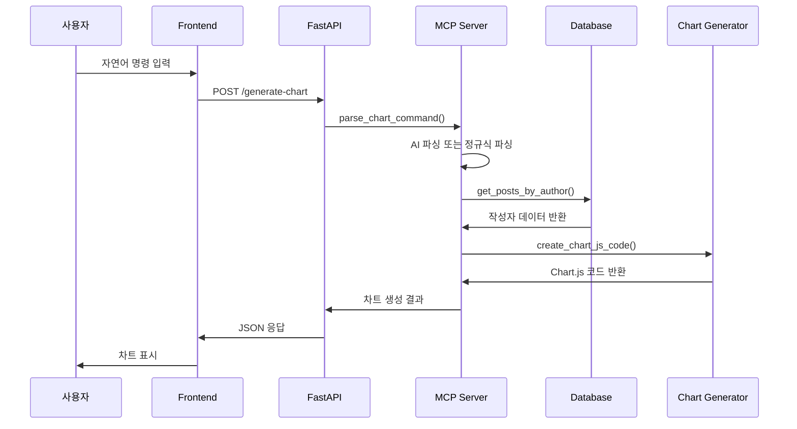
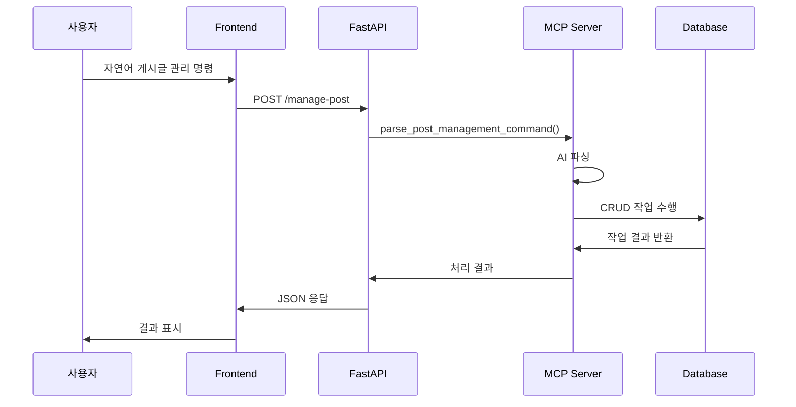

# 🧠 MCP 게시판 구현 로직 설명서

## 📋 목차
- [전체 아키텍처](#-전체-아키텍처)
- [핵심 컴포넌트](#-핵심-컴포넌트)
- [데이터 흐름](#-데이터-흐름)
- [API 엔드포인트](#-api-엔드포인트)
- [MCP 통합](#-mcp-통합)
- [데이터베이스 설계](#-데이터베이스-설계)
- [차트 생성 로직](#-차트-생성-로직)
- [에러 처리](#-에러-처리)
- [보안 고려사항](#-보안-고려사항)

---

## 🏗️ 전체 아키텍처

### 시스템 구성도
```
┌─────────────────┐    ┌─────────────────┐    ┌─────────────────┐
│   Frontend      │    │   FastAPI       │    │   Database      │
│   (HTML/CSS/JS) │◄──►│   Backend       │◄──►│   (SQLite)      │
└─────────────────┘    └─────────────────┘    └─────────────────┘
                              │
                              ▼
                       ┌─────────────────┐
                       │   MCP Server    │
                       │   (Anthropic)   │
                       └─────────────────┘
```

### 핵심 특징
- **비동기 처리**: FastAPI의 async/await 활용
- **모듈화 설계**: 각 기능이 독립적인 모듈로 분리
- **환경 분리**: 개발/프로덕션 환경 설정 분리
- **확장 가능**: 새로운 기능 추가 용이

---

## 🔧 핵심 컴포넌트

### 1. FastAPI 애플리케이션 (`app.py`)

#### 주요 기능
- **웹 서버**: FastAPI 기반 RESTful API 서버
- **템플릿 렌더링**: Jinja2를 통한 HTML 템플릿 처리
- **정적 파일 서빙**: CSS, JS 파일 제공
- **API 엔드포인트**: 차트 생성, 게시글 관리 등

#### 핵심 로직
```python
# 애플리케이션 생명주기 관리
@asynccontextmanager
async def lifespan(app: FastAPI):
    # 서버 시작 시 실행
    # - API 키 설정 확인
    # - 데이터베이스 초기화
    # - MCP 상태 확인
    yield
    # 서버 종료 시 실행
```

#### 데이터 모델
```python
class ChartRequest(BaseModel):
    command: str  # 자연어 차트 생성 명령

class PostRequest(BaseModel):
    author: str
    title: str
    content: str = ""
    numeric_value: float = None  # 차트용 숫자 데이터
    category: str = None
```

### 2. MCP 서버 (`mcp_server_real.py`)

#### 주요 기능
- **AI 통합**: Anthropic Claude API 연동
- **자연어 처리**: 사용자 명령을 파싱하여 차트 생성
- **실시간 차트 생성**: Chart.js 코드 동적 생성
- **다중 작성자 지원**: 여러 작성자 데이터 통합 차트

#### 핵심 로직
```python
class RealMCPServer:
    def __init__(self):
        self.client: Optional[AsyncAnthropic] = None
        self._initialize_client()  # API 키 확인 및 클라이언트 초기화
    
    async def parse_chart_command_with_ai(self, command: str):
        # AI를 사용한 자연어 명령 파싱
        # - 작성자명 추출
        # - 차트 타입 인식
        # - 추가 파라미터 분석
    
    async def generate_chart_code_with_ai(self, author_data, chart_type, author_name):
        # AI를 통한 Chart.js 코드 생성
        # - 데이터 분석
        # - 최적의 차트 타입 선택
        # - 시각화 코드 생성
```

### 3. 데이터베이스 관리 (`database.py`)

#### 주요 기능
- **ORM**: SQLAlchemy를 통한 객체 관계 매핑
- **데이터 모델링**: 게시글, 작성자, 숫자 데이터 관리
- **CRUD 작업**: 생성, 읽기, 수정, 삭제 기능
- **데이터 검색**: 작성자별, 카테고리별 필터링

#### 데이터 모델
```python
class Post(Base):
    __tablename__ = "posts"
    
    id = Column(Integer, primary_key=True, autoincrement=True)
    author = Column(String(50), nullable=False)      # 작성자명
    title = Column(String(200), nullable=False)      # 게시글 제목
    content = Column(Text)                           # 게시글 내용
    numeric_value = Column(Float)                    # 차트용 숫자 데이터
    category = Column(String(50))                    # 카테고리
    created_at = Column(DateTime, default=datetime.utcnow)  # 생성 시간
```

#### 핵심 메서드
```python
class DatabaseManager:
    def add_post(self, author, title, content, numeric_value=None, category=None):
        # 게시글 추가 (차트용 숫자 데이터 포함)
    
    def get_posts_by_author(self, author_name):
        # 특정 작성자의 모든 게시글 조회
    
    def get_authors_with_numeric_data(self):
        # 숫자 데이터가 있는 작성자 목록 조회
```

### 4. 차트 생성기 (`chart_generator.py`)

#### 주요 기능
- **Chart.js 코드 생성**: 동적 JavaScript 코드 생성
- **다양한 차트 타입**: 막대, 선, 원, 도넛 차트 지원
- **데이터 시각화**: 숫자 데이터를 시각적 차트로 변환
- **반응형 디자인**: 다양한 화면 크기에 대응

#### 핵심 로직
```python
class ChartGenerator:
    def create_chart_js_code(self, author_data, chart_type="bar"):
        # 1. 데이터 추출 (라벨, 값)
        # 2. 차트 타입별 설정 적용
        # 3. Chart.js 코드 동적 생성
        # 4. 반응형 옵션 설정
    
    def _get_chart_config(self, chart_type):
        # 차트 타입별 색상, 스타일, 옵션 설정
```

### 5. 설정 관리 (`config.py`)

#### 주요 기능
- **환경 변수 관리**: .env 파일 및 시스템 환경변수 처리
- **API 키 관리**: Anthropic API 키 설정 및 검증
- **서버 설정**: 호스트, 포트, 디버그 모드 등
- **보안 설정**: 비밀 키, 데이터베이스 URL 등

#### 핵심 로직
```python
class Config:
    def __init__(self):
        load_dotenv()  # .env 파일 로드
        self.ANTHROPIC_API_KEY = os.getenv("ANTHROPIC_API_KEY")
        # 기타 설정들...
    
    def is_api_key_configured(self) -> bool:
        # API 키 설정 여부 확인
```

---

## 🔄 데이터 흐름

### 1. 차트 생성 프로세스



### 2. 게시글 관리 프로세스



---

## 🌐 API 엔드포인트

### 웹페이지
- `GET /` - 메인 게시판 페이지

### 차트 관련
- `POST /generate-chart` - 차트 생성
- `GET /authors` - 사용 가능한 작성자 목록
- `GET /chart-types` - 지원하는 차트 타입 목록

### 게시글 관리
- `POST /add-post` - 게시글 추가
- `POST /manage-post` - MCP를 통한 자연어 게시글 관리
- `GET /posts` - 모든 게시글 조회
- `GET /posts/author/{author_name}` - 특정 작성자 게시글 조회
- `PUT /posts/{post_id}` - 게시글 수정
- `DELETE /posts/{post_id}` - 게시글 삭제

### 시스템 관리
- `GET /health` - 서버 상태 확인
- `GET /mcp-status` - MCP 상태 확인
- `POST /set-api-key` - API 키 설정
- `GET /mcp-logs` - MCP 통신 로그 조회
- `POST /clear-mcp-logs` - MCP 로그 초기화

---

## 🤖 MCP 통합

### 1. 자연어 명령 파싱

#### AI 기반 파싱
```python
async def parse_chart_command_with_ai(self, command: str):
    # Anthropic Claude API를 사용한 자연어 처리
    prompt = f"""
    다음 명령을 분석해서 JSON 형태로 파싱해주세요:
    명령: {command}
    
    응답 형식:
    {{
        "valid": true/false,
        "author_name": "작성자명",
        "chart_type": "차트타입",
        "is_multi_author": true/false,
        "author_names": ["작성자1", "작성자2"],
        "confidence": 0.0-1.0
    }}
    """
```

#### 폴백 파싱 (정규식)
```python
def _parse_chart_command_fallback(self, command: str):
    # AI 실패시 정규식을 사용한 기본 파싱
    patterns = {
        "author": r"([가-힣a-zA-Z]+)의",
        "chart_type": r"(막대|선|원|도넛|바|라인|파이|도너츠)",
        "multi_author": r"([가-힣a-zA-Z]+)과\s+([가-힣a-zA-Z]+)"
    }
```

### 2. 차트 코드 생성

#### AI 기반 생성
```python
async def generate_chart_code_with_ai(self, author_data, chart_type, author_name):
    # AI를 통한 최적화된 Chart.js 코드 생성
    prompt = f"""
    다음 데이터로 {chart_type} 차트를 생성해주세요:
    데이터: {author_data}
    작성자: {author_name}
    
    Chart.js 코드만 반환해주세요.
    """
```

#### 기본 생성
```python
def create_chart_js_code(self, author_data, chart_type="bar"):
    # 기본 Chart.js 코드 생성
    # - 데이터 추출
    # - 차트 설정 적용
    # - JavaScript 코드 생성
```

---

## 🗄️ 데이터베이스 설계

### 테이블 구조
```sql
CREATE TABLE posts (
    id INTEGER PRIMARY KEY AUTOINCREMENT,
    author VARCHAR(50) NOT NULL,           -- 작성자명
    title VARCHAR(200) NOT NULL,           -- 게시글 제목
    content TEXT,                          -- 게시글 내용
    numeric_value FLOAT,                   -- 차트용 숫자 데이터
    category VARCHAR(50),                  -- 카테고리
    created_at TIMESTAMP DEFAULT CURRENT_TIMESTAMP  -- 생성 시간
);
```

### 인덱스 설계
```sql
-- 작성자별 조회 최적화
CREATE INDEX idx_posts_author ON posts(author);

-- 숫자 데이터가 있는 게시글 조회 최적화
CREATE INDEX idx_posts_numeric ON posts(numeric_value) WHERE numeric_value IS NOT NULL;

-- 생성 시간순 정렬 최적화
CREATE INDEX idx_posts_created ON posts(created_at DESC);
```

### 데이터 관계
- **1:N 관계**: 작성자 → 게시글
- **카테고리 분류**: 게시글 → 카테고리
- **시간순 정렬**: 생성 시간 기준 내림차순

---

## 📊 차트 생성 로직

### 1. 차트 타입별 설정

#### 막대 차트 (Bar Chart)
```javascript
{
    type: 'bar',
    backgroundColor: 'rgba(54, 162, 235, 0.6)',
    borderColor: 'rgba(54, 162, 235, 1)',
    scales: {
        y: { beginAtZero: true },
        x: { title: { display: true, text: '게시글' } }
    }
}
```

#### 선 그래프 (Line Chart)
```javascript
{
    type: 'line',
    backgroundColor: 'rgba(75, 192, 192, 0.6)',
    borderColor: 'rgba(75, 192, 192, 1)',
    fill: false,
    tension: 0.1
}
```

#### 원 그래프 (Pie Chart)
```javascript
{
    type: 'pie',
    backgroundColor: [
        'rgba(255, 99, 132, 0.6)',
        'rgba(54, 162, 235, 0.6)',
        'rgba(255, 205, 86, 0.6)'
    ]
}
```

### 2. 다중 작성자 차트

#### 데이터 통합
```python
def generate_multi_author_chart(self, author_names, chart_type):
    # 1. 각 작성자의 데이터 수집
    all_data = []
    for author in author_names:
        author_posts = self.get_author_numeric_data(author)
        for post in author_posts:
            post['author'] = author  # 작성자 정보 추가
        all_data.extend(author_posts)
    
    # 2. 통합 차트 생성
    return self.create_multi_author_chart_code(all_data, chart_type, author_names)
```

#### 시각화 전략
- **색상 구분**: 작성자별 다른 색상 사용
- **범례 표시**: 작성자명과 색상 매핑
- **데이터 레이블**: 각 데이터 포인트에 값 표시

---

## ⚠️ 에러 처리

### 1. API 키 관련 에러
```python
def _initialize_client(self):
    if config.is_api_key_configured():
        try:
            self.client = AsyncAnthropic(api_key=config.ANTHROPIC_API_KEY)
        except Exception as e:
            print(f"❌ Anthropic 클라이언트 초기화 실패: {e}")
            self.client = None  # 시뮬레이션 모드로 전환
```

### 2. 데이터 검증
```python
def validate_chart_type(self, chart_type):
    valid_types = ["bar", "line", "pie", "doughnut"]
    return chart_type.lower() in valid_types

def validate_author_data(self, author_data):
    if not author_data:
        return False, "작성자의 숫자 데이터를 찾을 수 없습니다."
    return True, None
```

### 3. 네트워크 에러 처리
```python
async def generate_chart_with_retry(self, command, max_retries=3):
    for attempt in range(max_retries):
        try:
            return await self.generate_chart(command)
        except Exception as e:
            if attempt == max_retries - 1:
                return {"success": False, "message": f"차트 생성 실패: {str(e)}"}
            await asyncio.sleep(1)  # 재시도 전 대기
```

---

## 🔒 보안 고려사항

### 1. API 키 보안
```python
# 환경 변수로 관리
ANTHROPIC_API_KEY=sk-ant-api03-your_key_here

# 파일 권한 설정
chmod 600 .env
chown ubuntu:ubuntu .env
```

### 2. 입력 검증
```python
def sanitize_input(self, user_input: str) -> str:
    # XSS 방지
    return html.escape(user_input)

def validate_numeric_value(self, value) -> bool:
    # 숫자 데이터 검증
    try:
        float(value)
        return True
    except (ValueError, TypeError):
        return False
```

### 3. SQL 인젝션 방지
```python
# SQLAlchemy ORM 사용으로 자동 방지
def get_posts_by_author(self, author_name):
    session = self.get_session()
    try:
        posts = session.query(Post).filter(Post.author == author_name).all()
        return [post.to_dict() for post in posts]
    finally:
        session.close()
```

---

## 🚀 성능 최적화

### 1. 데이터베이스 최적화
```python
# 인덱스 활용
def get_authors_with_numeric_data(self):
    return session.query(Post.author).filter(
        Post.numeric_value.isnot(None)
    ).distinct().all()

# 페이지네이션
def get_all_posts(self, limit=10, offset=0):
    return session.query(Post).order_by(
        Post.created_at.desc()
    ).limit(limit).offset(offset).all()
```

### 2. 캐싱 전략
```python
# 메모리 캐시 (간단한 구현)
class ChartCache:
    def __init__(self):
        self.cache = {}
        self.max_size = 100
    
    def get(self, key):
        return self.cache.get(key)
    
    def set(self, key, value):
        if len(self.cache) >= self.max_size:
            # LRU 캐시 정리
            oldest_key = next(iter(self.cache))
            del self.cache[oldest_key]
        self.cache[key] = value
```

### 3. 비동기 처리
```python
# 동시 요청 처리
async def generate_multiple_charts(self, commands):
    tasks = [self.generate_chart(cmd) for cmd in commands]
    return await asyncio.gather(*tasks, return_exceptions=True)
```

---

## 🔧 확장 가능성

### 1. 새로운 차트 타입 추가
```python
def _get_chart_config(self, chart_type):
    configs = {
        # 기존 차트 타입들...
        "radar": {
            "backgroundColor": "rgba(255, 99, 132, 0.6)",
            "borderColor": "rgba(255, 99, 132, 1)",
            "fill": True
        },
        "bubble": {
            "backgroundColor": "rgba(75, 192, 192, 0.6)",
            "borderColor": "rgba(75, 192, 192, 1)"
        }
    }
    return configs.get(chart_type, configs["bar"])
```

### 2. 새로운 데이터 소스 추가
```python
class DataSource:
    def get_numeric_data(self, source_type, identifier):
        if source_type == "database":
            return self.get_from_database(identifier)
        elif source_type == "api":
            return self.get_from_api(identifier)
        elif source_type == "file":
            return self.get_from_file(identifier)
```

### 3. 새로운 AI 모델 지원
```python
class AIModelManager:
    def __init__(self):
        self.models = {
            "anthropic": AsyncAnthropic,
            "openai": AsyncOpenAI,
            "local": LocalLLM
        }
    
    def get_client(self, model_type):
        return self.models[model_type]()
```

---

## 📈 모니터링 및 로깅

### 1. 성능 모니터링
```python
import time

async def generate_chart_with_timing(self, command):
    start_time = time.time()
    try:
        result = await self.generate_chart(command)
        execution_time = time.time() - start_time
        await mcp_logger.log_performance("chart_generation", execution_time)
        return result
    except Exception as e:
        await mcp_logger.log_error("chart_generation", str(e))
        raise
```

### 2. 사용자 행동 분석
```python
async def log_user_interaction(self, action, details):
    await mcp_logger.log_user_action(action, {
        "timestamp": datetime.utcnow(),
        "user_agent": request.headers.get("user-agent"),
        "ip_address": request.client.host,
        "details": details
    })
```

---

## 🎯 결론

이 MCP 게시판 시스템은 다음과 같은 특징을 가지고 있습니다:

### 핵심 강점
1. **모듈화 설계**: 각 컴포넌트가 독립적으로 동작
2. **확장 가능성**: 새로운 기능 추가 용이
3. **성능 최적화**: 비동기 처리 및 캐싱 활용
4. **보안 고려**: 입력 검증 및 API 키 보안
5. **사용자 친화적**: 자연어 인터페이스 제공

### 기술적 특징
- **FastAPI**: 고성능 비동기 웹 프레임워크
- **SQLAlchemy**: 강력한 ORM 및 데이터베이스 관리
- **Chart.js**: 동적 차트 생성 및 시각화
- **Anthropic Claude**: 고급 자연어 처리
- **Jinja2**: 템플릿 기반 UI 렌더링

이 시스템을 통해 사용자는 자연어 명령으로 데이터를 시각화하고, 개발자는 확장 가능한 아키텍처를 활용할 수 있습니다.